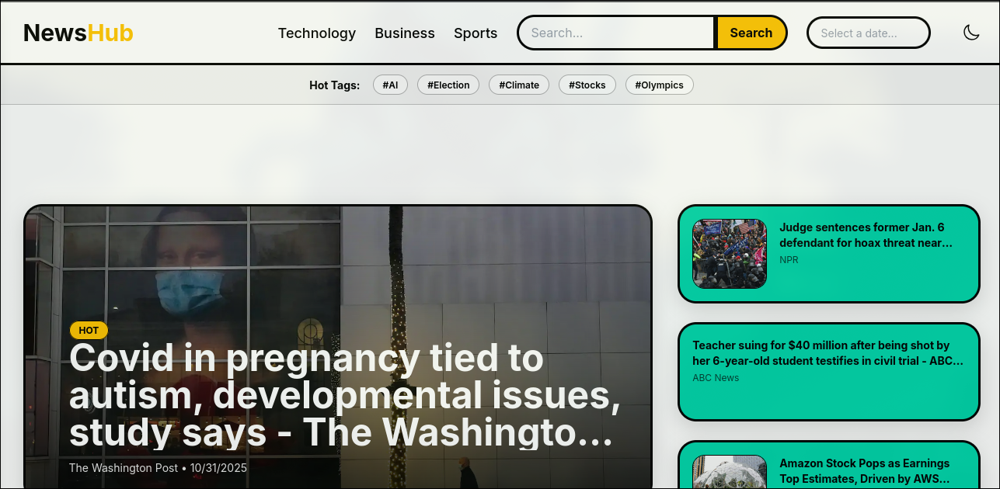
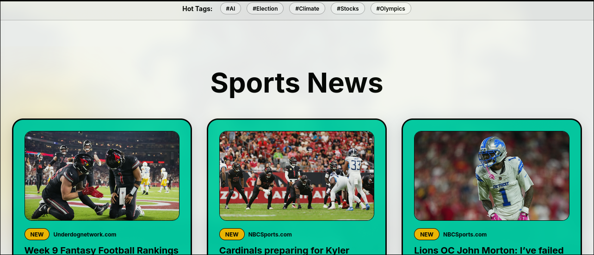
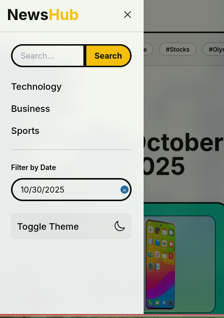
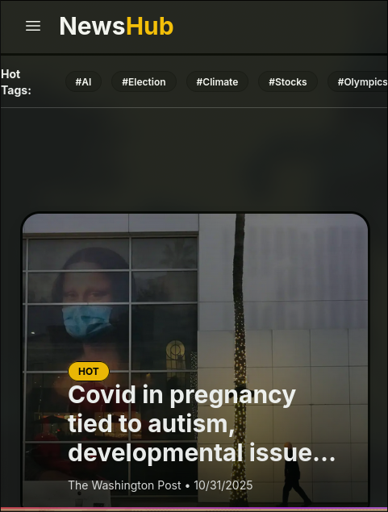

# NewsHub

* **Nama:** Daniel Calvin Simanjuntak
* **NIM:** 123140004

## Deskripsi Proyek

NewsHub adalah aplikasi web portal berita modern yang dibangun menggunakan React, Vite, dan Tailwind CSS. Aplikasi ini mengambil data secara *live* ataau langsung dari [NewsAPI.org](https://newsapi.org/), memungkinkan pengguna untuk membaca berita terbaru dari berbagai kategori.

Proyek ini mengimplementasikan berbagai fitur web modern, termasuk *client-side routing*, manajemen *state* dengan React Hooks, *responsive design* untuk *mobile* dan *desktop*, serta pemfilteran data yang interaktif.

## Fitur Utama

* **Halaman Home:** Halaman *landing* kustom yang menampilkan berita utama (*hero*) dan ringkasan berita dari berbagai kategori.
* **Pencarian & Filter:**
    * Pencarian artikel berdasarkan *keyword* (topik).
    * Filter berdasarkan kategori (Technology, Business, Sports).
    * Filter berdasarkan "Hot Tags" (AI, Climate, dll.).
    * Filter berdasarkan tanggal spesifik menggunakan *date picker* .
* **Pagination:** Menggunakan tombol "Load More" untuk memuat artikel tambahan tanpa me-*refresh* halaman..
* **Responsive Design:** Tampilan *desktop* dan *mobile* yang adaptif, lengkap dengan *sidebar* untuk navigasi dan filter di perangkat *mobile*.
* **Dark Mode:** *Toggle* untuk beralih antara tema terang dan gelap.
* **Detail Artikel:** Halaman detail yang *robust*, mampu di-*refresh* atau diakses langsung melalui URL tanpa kehilangan data.

## Screenshot

| Tampilan Desktop (Home) | Tampilan Desktop (Filter) |
| :---: | :---: |
|  |  |

| Tampilan Mobile (Sidebar) | Tampilan Mobile (Dark Mode) |
| :---: | :---: |
|  |  |


## Teknologi yang Digunakan

* **Framework:** React 18+ (Vite)
* **Styling:** Tailwind CSS
* **State Management:** React Hooks (`useState`, `useEffect`, `useCallback`, `useRef`)
* **HTTP Client:** Axios
* **Library Tambahan:**
    * `react-router-dom`: Untuk *client-side routing* (SPA).
    * `react-datepicker`: Untuk fitur filter tanggal.
    * `@heroicons/react` & `lucide-react`: Untuk ikonografi UI.
    * `date-fns`: Untuk memformat tanggal.

## Cara Instalasi dan Menjalankan Proyek

1.  **Clone repository ini:**
    ```bash
    git clone [git@github.com:daniel-got/uts-pemweb-1231400004.git](https://github.com/daniel-got/uts-pemweb-1231400004.git)
    cd uts-pemweb-1231400004
    ```

2.  **Install dependencies:**
    ```bash
    npm install
    ```

3.  **Buat file `.env`:**
    Buat file bernama `.env` di *root* proyek dan tambahkan API Key Anda dari [NewsAPI.org](https://newsapi.org/).

    ```
    VITE_NEWS_API_KEY=KEY_API_ANDA_DISINI
    VITE_NEWS_API_BASE_URL=[https://newsapi.org/v2](https://newsapi.org/v2)
    ```

4.  **Jalankan aplikasi (mode development):**
    ```bash
    npm run dev
    ```
    Aplikasi akan berjalan di `http://localhost:5173`.

## Link Deployment

Aplikasi ini telah di-*deploy* menggunakan Vercel.
newshub.vercel.app
